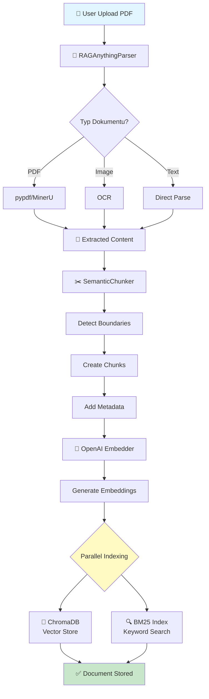
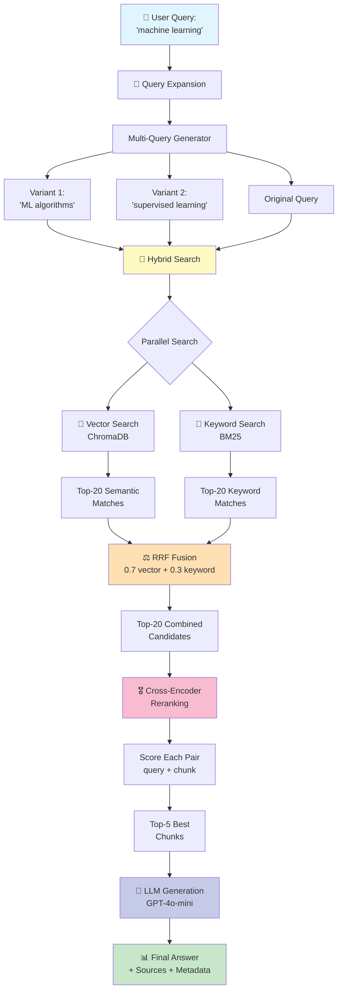
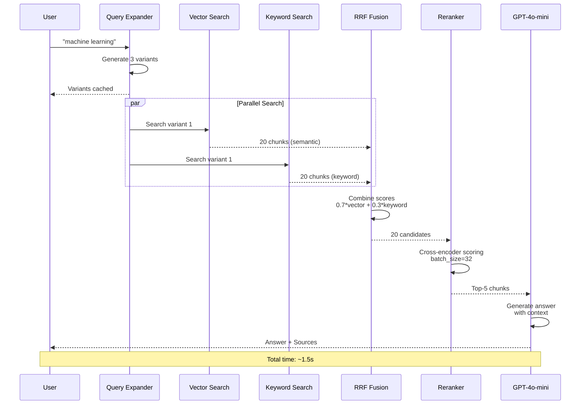
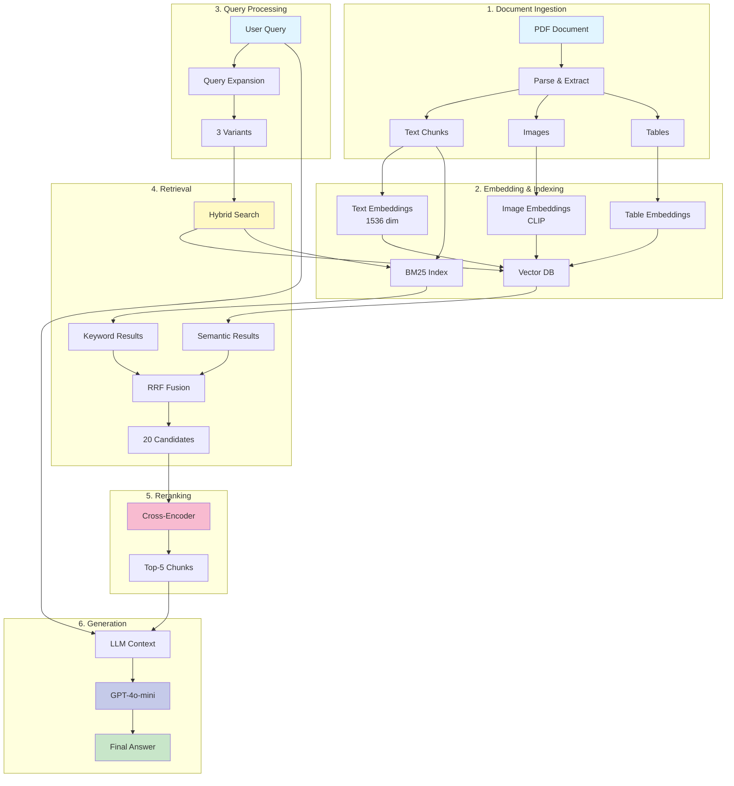
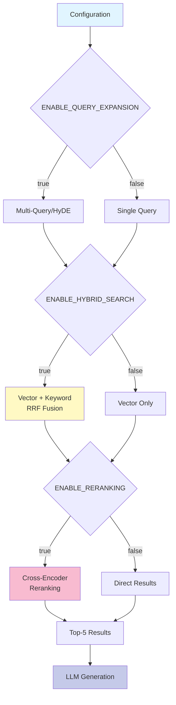
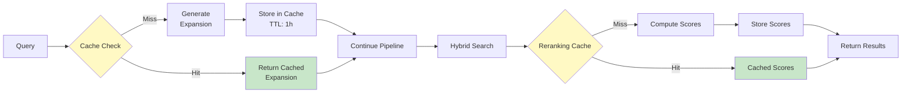
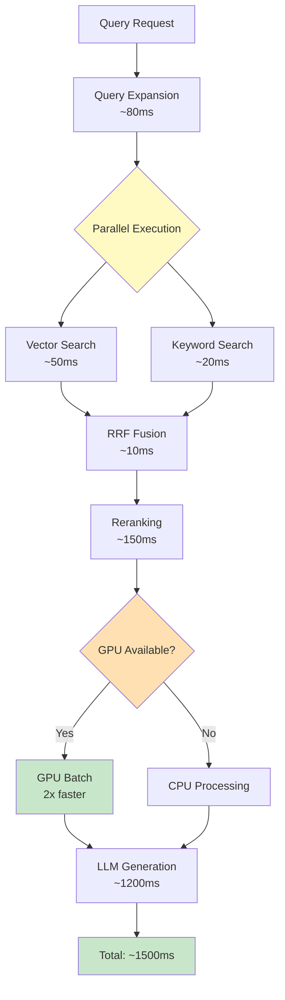

# RAG System - Wizualne Diagramy Przepływu

## 📤 Flow 1: Upload i Przetwarzanie Dokumentu



## 🔍 Flow 2: Query Processing (Enhanced Retrieval)



## 🎯 Szczegółowy Flow: Hybrid Search + Reranking



## 🏗️ Architektura Komponentów

```mermaid
graph LR
    subgraph "Frontend"
        A[User Interface]
    end
    
    subgraph "API Layer"
        B[FastAPI Endpoints]
        B1[/documents/upload]
        B2[/query]
        B3[/health]
    end
    
    subgraph "Services"
        C[DocumentService]
        D[QueryService]
    end
    
    subgraph "Processing"
        E[RAGAnythingParser]
        F[SemanticChunker]
        G[OpenAI Embedder]
    end
    
    subgraph "Retrieval"
        H[QueryExpander]
        I[HybridSearchEngine]
        J[CrossEncoderReranker]
    end
    
    subgraph "Storage"
        K[(ChromaDB<br/>Vector Store)]
        L[(BM25 Index<br/>Keyword)]
    end
    
    A --> B
    B --> B1
    B --> B2
    B --> B3
    
    B1 --> C
    B2 --> D
    
    C --> E
    C --> F
    C --> G
    
    E --> K
    F --> K
    G --> K
    E --> L
    
    D --> H
    D --> I
    D --> J
    
    I --> K
    I --> L
    
    style A fill:#e1f5ff
    style K fill:#c8e6c9
    style L fill:#c8e6c9
    style I fill:#fff9c4
    style J fill:#f8bbd0
```

## 📊 Data Flow: Od Dokumentu do Odpowiedzi



## 🎛️ Configuration Impact



## 🔄 Caching Strategy



## 📈 Performance Optimization



## 🎯 Scoring Mechanism

```mermaid
graph TD
    A[Chunk] --> B{Scoring Stages}
    
    B --> C[Stage 1: Vector<br/>Cosine Similarity<br/>0.0 - 1.0]
    B --> D[Stage 2: Keyword<br/>BM25 Score<br/>0.0 - 20.0]
    
    C --> E[Normalize Vector<br/>score_v]
    D --> F[Normalize BM25<br/>score_k]
    
    E --> G[RRF Score<br/>0.7*score_v + 0.3*score_k]
    F --> G
    
    G --> H[Stage 3: Reranking<br/>Cross-Encoder<br/>-10.0 - 10.0]
    
    H --> I[Normalize to [0,1]<br/>final_score]
    
    I --> J{final_score > threshold?}
    J -->|Yes| K[Include in Results]
    J -->|No| L[Discard]
    
    style G fill:#fff9c4
    style H fill:#f8bbd0
    style K fill:#c8e6c9
```

---

## 📝 Legenda

- 🔵 **Niebieski**: User input/output
- 🟡 **Żółty**: Processing/Computation
- 🟠 **Pomarańczowy**: Fusion/Combination
- 🔴 **Różowy**: Reranking/Scoring
- 🟣 **Fioletowy**: LLM Generation
- 🟢 **Zielony**: Final result/Success

---

## 🎓 Kluczowe Punkty

1. **Parallel Processing**: Vector + Keyword search równolegle
2. **Multi-Stage Scoring**: RRF → Reranking → Final
3. **Caching**: Query expansion i reranking scores
4. **GPU Acceleration**: Dla reranking (2x szybciej)
5. **Configurable**: Każdy stage można włączyć/wyłączyć
