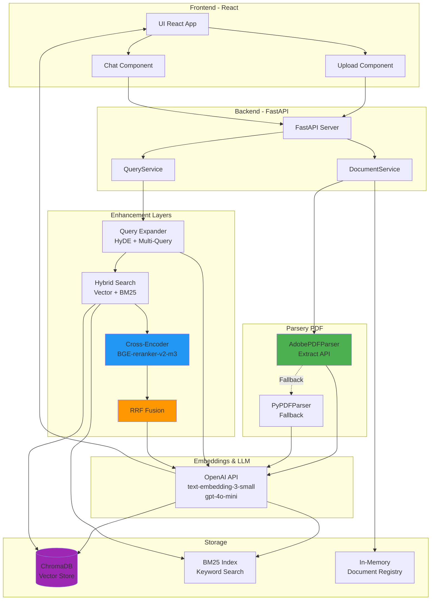
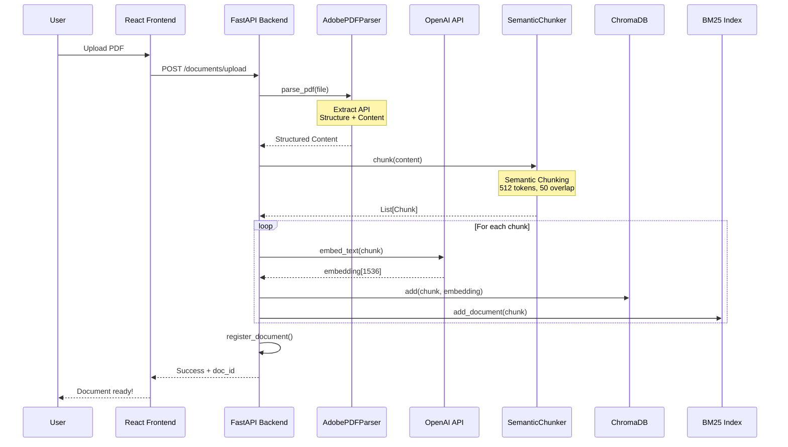
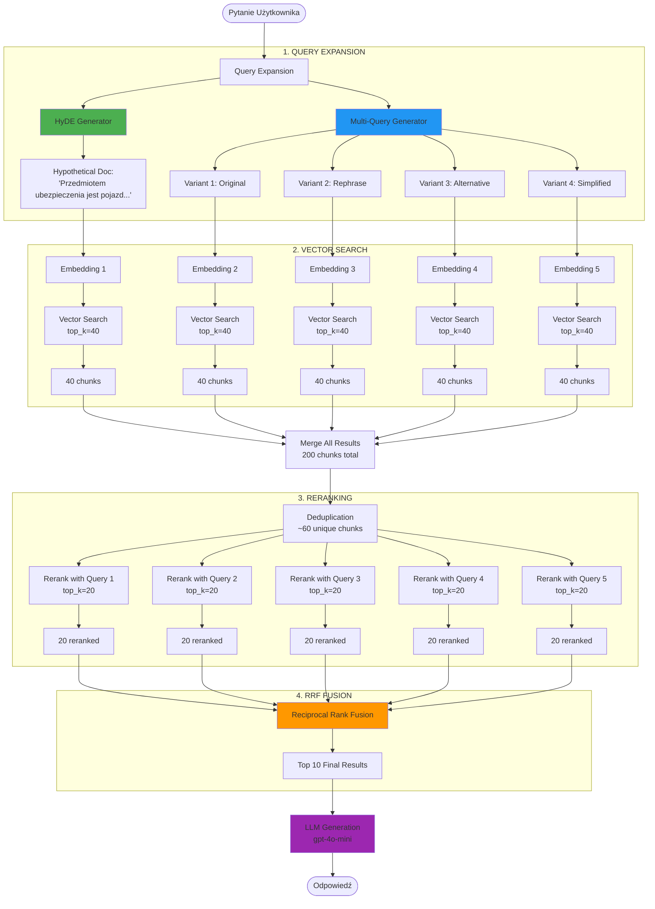
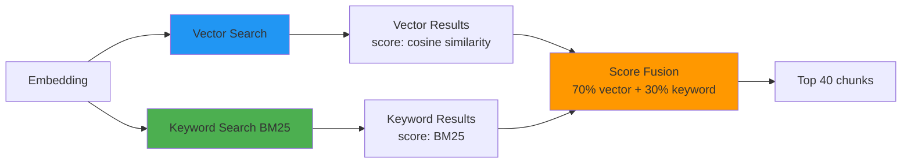
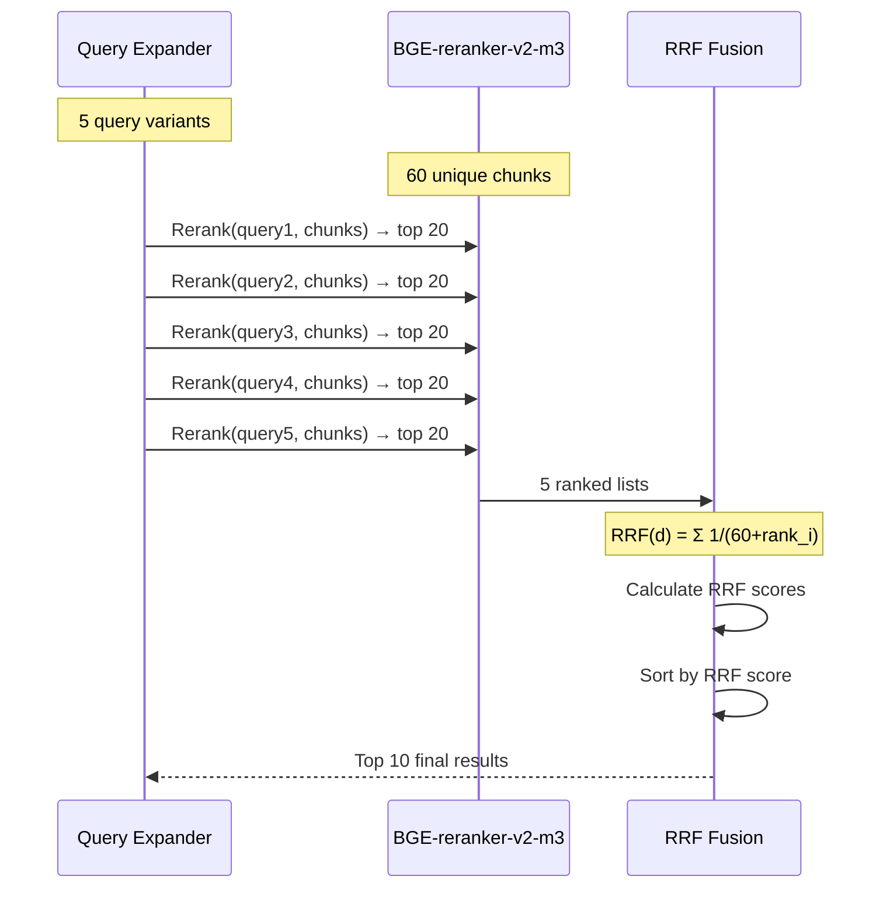
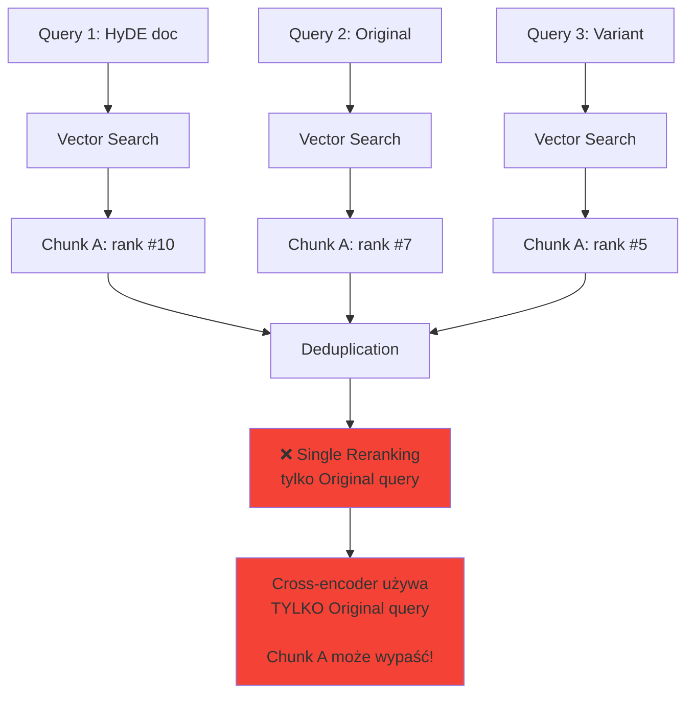
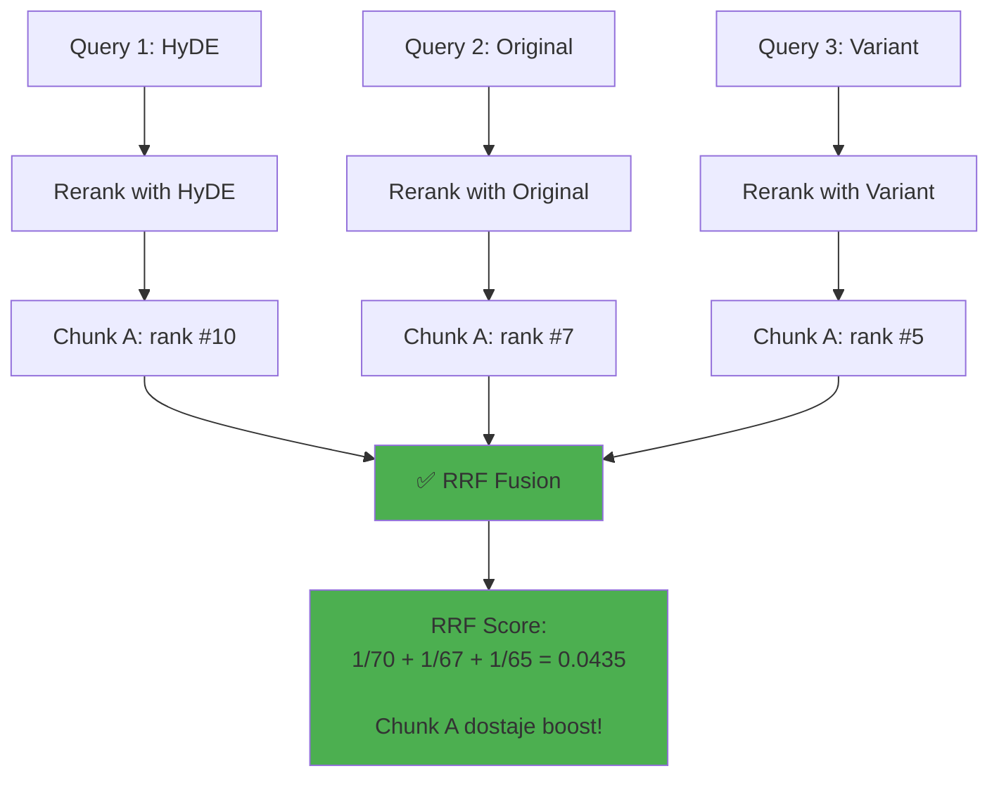

# RAG Pipeline - Kompletny Przewodnik

## Spis Treści

1. [Przegląd Modeli AI](#przegląd-modeli-ai)
2. [Architektura Systemu](#architektura-systemu)
3. [Pipeline Wgrywania Dokumentów](#pipeline-wgrywania-dokumentów)
4. [Pipeline Query (Pytania)](#pipeline-query-pytania)
5. [Query Expansion](#query-expansion)
6. [Reranking z RRF](#reranking-z-rrf)
7. [Szczegóły Techniczne](#szczegóły-techniczne)
8. [Jak Używać](#jak-używać)
9. [Przykłady](#przykłady)

---

## Przegląd Modeli AI

System wykorzystuje 3 różne modele AI w pipeline:

| Model | Rola | Provider | Parametry |
|-------|------|----------|-----------|
| **text-embedding-3-small** | Embeddings (wektoryzacja tekstu) | OpenAI | 1536-dim, 8191 tokens context |
| **gpt-4o-mini** | **Generowanie odpowiedzi** | OpenAI | 128K context, 16K output max |
| **bge-reranker-v2-m3** | Reranking (poprawa kolejności) | BAAI/HuggingFace | Multilingual cross-encoder |

**Najważniejszy:** Model **GPT-4o-mini** generuje finalne odpowiedzi na pytania użytkownika na podstawie top 10 najlepszych chunków z dokumentów.

---

## Architektura Systemu



---

## Pipeline Wgrywania Dokumentów

### Diagram Przepływu



### Krok po Kroku

#### 1. Upload PDF
```bash
POST /documents/upload
Content-Type: multipart/form-data

file: document.pdf
```

#### 2. Parsing z Adobe Extract API

**Adobe PDF Extract API** (`app/parsers/adobe_parser.py`):
```python
# Adobe Extract API wyodrębnia:
- Tekst z rozpoznaniem struktury
- Tabele jako struktury danych
- Obrazy z opisami
- Nagłówki i hierarchię
- Kontekst semantyczny (tytuł, sekcja, etc.)

# Fallback: PyPDFParser jeśli Adobe nie działa
```

**Wynik parsowania:**
```json
{
  "text": "Pełna treść dokumentu...",
  "metadata": {
    "title": "AUTOCASCO STANDARD",
    "page_count": 8,
    "structure": [...]
  }
}
```

#### 3. Semantic Chunking

**SemanticChunker** (`app/chunking/semantic_chunker.py`):
```python
# Parametry:
chunk_size = 512 tokens       # Maksymalny rozmiar
chunk_overlap = 50 tokens     # Overlap między chunkami
use_structure = True          # Używa struktury z Adobe

# Proces:
1. Podział tekstu na zdania
2. Grupowanie zdań w chunki ~512 tokens
3. Dodawanie overlap (50 tokens)
4. Zachowanie kontekstu ze struktury Adobe
```

**Przykładowy chunk:**
```
[Context: Produkt: AUTOCASCO STANDARD ]

Pojazd (silnikowy lub przyczepa/naczepa), wraz z jego wyposażeniem,
Warta ubezpiecza od:
✔ uszkodzenia
✔ całkowitego zniszczenia
✔ kradzieży w całości lub jego części...
```

#### 4. Embeddings

**OpenAI Embeddings** (`text-embedding-3-small`):
```python
# Dla każdego chunka:
embedding = openai.embeddings.create(
    model="text-embedding-3-small",
    input=chunk_content
)
# Wynik: vector[1536] - reprezentacja semantyczna
```

#### 5. Indeksowanie

**ChromaDB** - Vector Store:
```python
collection.add(
    ids=[chunk_id],
    embeddings=[embedding],
    documents=[chunk_content],
    metadatas=[{
        "doc_id": "...",
        "page": 2,
        "chunk_index": 5
    }]
)
```

**BM25** - Keyword Index:
```python
bm25_index.add_document(
    doc_id=chunk_id,
    content=chunk_content
)
```

---

## Pipeline Query (Pytania)

### Diagram Pełnego Pipeline



### Krok po Kroku

#### KROK 1: Query Expansion

**Pytanie użytkownika:**
```
"Co jest przedmiotem ubezpieczenia?"
```

**Query Expander** (`app/retrieval/query_expansion.py`):

```python
# Metoda: hybrid (HyDE + Multi-Query)
queries = await query_expander.expand(question)

# Wynik: 5 wariantów
```

**HyDE (Hypothetical Document Embedding):**
```
Prompt do LLM:
"Please write a passage to answer the question:
Question: Co jest przedmiotem ubezpieczenia?
Passage:"

Wygenerowana odpowiedź (hypothetical doc):
"Przedmiotem ubezpieczenia jest to, co jest chronione przez umowę
ubezpieczeniową. W przypadku ubezpieczenia autocasco przedmiotem
jest pojazd wraz z jego wyposażeniem..."
```

**Multi-Query:**
```
Prompt do LLM:
"Generate 3 different ways to ask: Co jest przedmiotem ubezpieczenia?"

Wygenerowane warianty:
1. "Co jest przedmiotem ubezpieczenia?"
2. "Czym jest objęty zakres ubezpieczenia?"
3. "Jakie mienie podlega ubezpieczeniu?"
4. "Co dokładnie jest ubezpieczone?"
```

**5 Total Query Variants:**
1. HyDE hypothetical doc
2. Original question
3. Variant 1
4. Variant 2
5. Variant 3

#### KROK 2: Embeddings

Dla każdego z 5 wariantów:
```python
embedding = await openai.embed_text(query)
# Wynik: 5 × embedding[1536]
```

#### KROK 3: Hybrid Search

**Dla każdego embedding osobno:**



**Vector Search** (`ChromaDB`):
```python
# Cosine similarity między query embedding a chunk embeddings
results = collection.query(
    query_embeddings=[embedding],
    n_results=40
)
# Score: 0.0 - 1.0 (wyższy = bardziej podobny)
```

**Keyword Search** (`BM25`):
```python
# BM25 scoring dla keyword matching
results = bm25.search(
    query=query_text,
    top_k=40
)
# Score: wartość BM25 (wyższy = lepszy match)
```

**Hybrid Fusion:**
```python
final_score = (
    0.7 * normalize(vector_score) +
    0.3 * normalize(bm25_score)
)
```

**Wynik dla wszystkich 5 zapytań:**
```
Query 1 (HyDE): 40 chunks
Query 2 (Original): 40 chunks
Query 3 (Variant 1): 40 chunks
Query 4 (Variant 2): 40 chunks
Query 5 (Variant 3): 40 chunks
────────────────────────────
TOTAL: 200 chunks (z duplikatami)
```

#### KROK 4: Deduplication

```python
# Usuń duplikaty po chunk_id
seen_chunks = set()
unique_results = []
for result in all_results:
    if result.chunk_id not in seen_chunks:
        seen_chunks.add(result.chunk_id)
        unique_results.append(result)

# Wynik: ~60 unikalnych chunks
```

**Dlaczego ~60?**
- Niektóre chunki występują w wielu wyszukaniach
- Top chunki często powtarzają się
- 200 → ~60 po deduplikacji

#### KROK 5: Multi-Query Reranking



**Cross-Encoder Reranking:**

BGE-reranker-v2-m3 dla każdego query wariantu:
```python
# Cross-encoder: joint encoding of query + document
for query in queries:
    scores = model.predict([
        [query, chunk1],
        [query, chunk2],
        ...
        [query, chunk60]
    ])
    # Score: -infinity do +infinity (wyższy = lepszy)
    # Top 20 dla każdego query
```

**Dlaczego BGE-reranker-v2-m3?**
- ✅ Multilingual (lepszy dla polskiego)
- ✅ State-of-the-art quality
- ✅ Lepiej radzi sobie z listami punktowanymi
- ✅ Lepiej rozumie kontekst dokumentów

#### KROK 6: RRF Fusion

**Reciprocal Rank Fusion:**

```python
def reciprocal_rank_fusion(ranked_lists, k=60):
    """
    RRF score dla dokumentu d:
        RRF(d) = Σ (dla wszystkich rankingów i) 1 / (k + rank_i(d))

    gdzie:
    - k = 60 (stała redukująca wpływ wysokich rang)
    - rank_i(d) = pozycja dokumentu d w rankingu i
    """
    rrf_scores = {}

    for ranked_list in ranked_lists:
        for rank, doc in enumerate(ranked_list, start=1):
            # RRF formula
            score = 1.0 / (60 + rank)

            if doc.id in rrf_scores:
                rrf_scores[doc.id] += score
            else:
                rrf_scores[doc.id] = score

    # Sortuj po RRF score (malejąco)
    return sorted(rrf_scores, key=score, reverse=True)
```

**Przykład:**

Chunk "Pojazd (silnikowy..." w różnych rankingach:
```
Reranking 1 (HyDE):      rank #10 → 1/(60+10) = 0.0143
Reranking 2 (Original):  rank #7  → 1/(60+7)  = 0.0149
Reranking 3 (Variant 1): rank #9  → 1/(60+9)  = 0.0145
Reranking 4 (Variant 2): rank #11 → 1/(60+11) = 0.0141
Reranking 5 (Variant 3): rank #5  → 1/(60+5)  = 0.0154
────────────────────────────────────────────────────────
RRF Score: 0.0143 + 0.0149 + 0.0145 + 0.0141 + 0.0154 = 0.0732
```

Chunk "Suma ubezpieczenia..." w różnych rankingach:
```
Reranking 1: rank #1  → 1/(60+1)  = 0.0164
Reranking 2: rank #1  → 1/(60+1)  = 0.0164
Reranking 3: rank #2  → 1/(60+2)  = 0.0161
Reranking 4: rank #3  → 1/(60+3)  = 0.0159
Reranking 5: rank #4  → 1/(60+4)  = 0.0156
────────────────────────────────────────────────────────
RRF Score: 0.0164 + 0.0164 + 0.0161 + 0.0159 + 0.0156 = 0.0804
```

**Wynik:** Top 10 chunków posortowanych po RRF score

**Zalety RRF:**
- ✅ Chunki ważne dla wielu wariantów dostają boost
- ✅ Lepszy recall - różne perspektywy
- ✅ Lepszy precision - konsensus między rankingami
- ✅ Robust - nie zależy od pojedynczego rerankingu

#### KROK 7: LLM Generation (GPT-4o-mini)

**Model:** OpenAI GPT-4o-mini
- Context: 128K tokens (wystarczy dla wielu chunków)
- Output: do 16K tokens
- Koszt Input: $0.15 / 1M tokens
- Koszt Output: $0.60 / 1M tokens
- Szybkość: ~100 tokens/s

**Context Building:**
```python
context = ""
for i, chunk in enumerate(top_10_chunks, 1):
    context += f"[Źródło {i}] (Strona {chunk.page})\n"
    context += chunk.content + "\n\n"
```

**Prompt do LLM:**
```
System: You are a helpful assistant that answers questions based on provided context.

User:
Context:
[Źródło 1] (Strona 0)
Pojazd (silnikowy lub przyczepa/naczepa), wraz z jego wyposażeniem,
Warta ubezpiecza od:
✔ uszkodzenia
✔ całkowitego zniszczenia
✔ kradzieży...

[Źródło 2] (Strona 0)
Suma ubezpieczenia odpowiada wartości ubezpieczonego pojazdu...

...

Question: Co jest przedmiotem ubezpieczenia?

Answer based only on the provided context.
```

**LLM Response:**
```
Przedmiotem ubezpieczenia AUTOCASCO STANDARD jest:

- Pojazd (silnikowy lub przyczepa/naczepa), wraz z jego wyposażeniem,
  który jest ubezpieczany od:
  ✔ uszkodzenia
  ✔ całkowitego zniszczenia
  ✔ kradzieży w całości lub jego części

Suma ubezpieczenia odpowiada wartości ubezpieczonego pojazdu w danym
momencie trwania umowy. Szczegółowy opis zawarty jest w §2 i §3 OWU.
```

**Jak GPT-4o-mini przetwarza informacje:**

1. **Otrzymuje kontekst:** Top 10 chunków z reranking (po RRF fusion)
2. **Analiza semantyczna:** Rozumie znaczenie pytania i kontekstu
3. **Synteza informacji:** Łączy informacje z wielu źródeł
4. **Formatowanie:** Tworzy czytelną odpowiedź z listami, strukturą
5. **Weryfikacja:** Opiera odpowiedź TYLKO na dostarczonym kontekście

**Dlaczego GPT-4o-mini?**
- ✅ Świetna jakość rozumienia i generowania tekstu (prawie jak GPT-4)
- ✅ 128K context - pomieści wiele chunków bez problemu
- ✅ Tanio - ~40x taniej niż GPT-4
- ✅ Szybko - ~100 tokens/s odpowiedzi
- ✅ Doskonały dla języka polskiego

**Alternatywy:**
- **GPT-4** - lepsza jakość, ale ~40x droższy
- **GPT-3.5-turbo** - tańszy, ale gorsza jakość
- **Claude 3.5 Sonnet** - podobna jakość, ale droższy

---

## Query Expansion

### Diagram Szczegółowy

```mermaid
flowchart TD
    Q[User Question:<br/>'Co jest przedmiotem ubezpieczenia?'] --> Choice{Expansion<br/>Method?}

    Choice -->|none| Original[Use Original Only]
    Choice -->|multi-query| Multi[Multi-Query Expansion]
    Choice -->|hyde| Hyde[HyDE Expansion]
    Choice -->|hybrid| Hybrid[Hybrid Expansion]

    subgraph "Multi-Query"
        Multi --> MP[Prompt LLM:<br/>'Generate 3 alternative questions']
        MP --> MR[3-4 query variations]
        MR --> MA[Add original question]
        MA --> MOut[4 queries total]
    end

    subgraph "HyDE"
        Hyde --> HP[Prompt LLM:<br/>'Write passage to answer question']
        HP --> HR[Hypothetical document]
        HR --> HOut[1 hypothetical doc]
    end

    subgraph "Hybrid"
        Hybrid --> HyP[Generate HyDE doc]
        Hybrid --> MuP[Generate Multi-Query variants]
        HyP --> HyR[1 hypothetical doc]
        MuP --> MuR[4 query variations]
        HyR --> Combine[Combine All]
        MuR --> Combine
        Combine --> HybOut[5 queries total:<br/>1 HyDE + 4 Multi-Query]
    end

    Original --> Out1[1 query]
    MOut --> Out2[4 queries]
    HOut --> Out3[1 query]
    HybOut --> Out4[5 queries]

    Out1 --> Next[→ Vector Search]
    Out2 --> Next
    Out3 --> Next
    Out4 --> Next

    style Hyde fill:#4CAF50
    style Multi fill:#2196F3
    style Hybrid fill:#FF9800
```

### Porównanie Metod

| Metoda | Liczba Queries | Zalety | Wady | Kiedy używać |
|--------|---------------|--------|------|--------------|
| **none** | 1 | Najszybsza | Słaby recall | Proste pytania |
| **multi-query** | 4 | Dobry recall dla różnych fraz | Nie łapie semantyki odpowiedzi | Pytania z synonimami |
| **hyde** | 1 | Łapie semantykę odpowiedzi | Może generować nieprawdziwe info | Pytania wymagające szczegółów |
| **hybrid** | 5 | Najlepszy recall + precision | Wolniejsza | **ZALECANE** - najlepsze wyniki |

---

## Reranking z RRF

### Dlaczego Multi-Query Reranking?

**Problem z Single-Query Reranking:**



**Rozwiązanie z Multi-Query Reranking:**



### Wzór RRF

```
RRF_score(d) = Σ[i=1 do n] 1 / (k + rank_i(d))

gdzie:
- d = dokument (chunk)
- n = liczba rankingów (5 dla hybrid)
- k = stała (60) - redukuje wpływ wysokich rang
- rank_i(d) = pozycja dokumentu d w rankingu i
```

**Przykład Obliczenia:**

Mamy 3 rankingi:

```
Ranking 1:    Ranking 2:    Ranking 3:
1. Doc A      1. Doc B      1. Doc C
2. Doc B      2. Doc A      2. Doc A
3. Doc C      3. Doc C      3. Doc B
4. Doc D      4. Doc E      4. Doc D
5. Doc E      5. Doc D      5. Doc E
```

**RRF Scores:**

```python
# Doc A:
rank1 = 1, rank2 = 2, rank3 = 2
RRF_A = 1/(60+1) + 1/(60+2) + 1/(60+2)
      = 0.0164 + 0.0161 + 0.0161
      = 0.0486

# Doc B:
rank1 = 2, rank2 = 1, rank3 = 3
RRF_B = 1/(60+2) + 1/(60+1) + 1/(60+3)
      = 0.0161 + 0.0164 + 0.0159
      = 0.0484

# Doc C:
rank1 = 3, rank2 = 3, rank3 = 1
RRF_C = 1/(60+3) + 1/(60+3) + 1/(60+1)
      = 0.0159 + 0.0159 + 0.0164
      = 0.0482

# Final ranking po RRF:
1. Doc A (0.0486)
2. Doc B (0.0484)
3. Doc C (0.0482)
```

**Doc A wygrywa** pomimo że nie był #1 we wszystkich rankingach!

---

## Szczegóły Techniczne

### Technologie

| Komponent | Technologia | Wersja | Rola |
|-----------|------------|--------|------|
| **Backend** | FastAPI | 0.109+ | REST API server |
| **Frontend** | React | 18+ | User interface |
| **Parser** | Adobe PDF Extract API | - | Ekstrakcja struktury PDF |
| **Fallback Parser** | PyPDF | 4.0+ | Backup parser |
| **Embeddings** | OpenAI text-embedding-3-small | - | 1536-dim vectors |
| **LLM** | OpenAI gpt-4o-mini | - | Answer generation |
| **Vector DB** | ChromaDB | 0.4.22+ | Semantic search |
| **Keyword Search** | BM25 (rank-bm25) | 0.2.2+ | Keyword matching |
| **Reranker** | BGE-reranker-v2-m3 | - | Cross-encoder reranking |
| **Chunking** | Custom Semantic | - | Structure-aware |

### Modele

#### 1. Embedding Model

**text-embedding-3-small**
```yaml
Provider: OpenAI
Dimensions: 1536
Context Length: 8191 tokens
Cost: $0.00002 / 1K tokens
Speed: ~1000 tokens/s
```

**Dlaczego ten model?**
- ✅ Świetna jakość dla ceny
- ✅ Szybki
- ✅ Duży context window
- ✅ Dobry dla wielu języków (w tym polski)

#### 2. LLM Model

**gpt-4o-mini**
```yaml
Provider: OpenAI
Context: 128K tokens
Output: 16K max tokens
Cost Input: $0.15 / 1M tokens
Cost Output: $0.60 / 1M tokens
Speed: ~100 tokens/s
```

**Dlaczego ten model?**
- ✅ Świetna jakość odpowiedzi
- ✅ Tanio
- ✅ Szybki
- ✅ Duży context (pomieści dużo chunków)

#### 3. Reranker Model

**BAAI/bge-reranker-v2-m3**
```yaml
Provider: BAAI (HuggingFace)
Type: Cross-encoder
Size: ~558M parameters
Languages: Multilingual (100+ języków)
Input: Query + Document pairs
Output: Relevance score
```

**Dlaczego ten model?**
- ✅ State-of-the-art quality
- ✅ Multilingual (świetny dla polskiego)
- ✅ Lepiej radzi sobie z listami/strukturami
- ✅ Lepszy od MS-MARCO dla dokumentów
- ⚠️ Wolniejszy (~2x) ale warto

**Alternatywa (szybsza):**
```yaml
Model: cross-encoder/ms-marco-MiniLM-L-6-v2
Size: ~90M parameters
Speed: 2x szybszy
Quality: Dobra dla angielskiego, słaba dla polskiego
```

### Parametry Konfiguracji

**`.env` file:**

```bash
# LLM Settings
OPENAI_API_KEY=sk-...
OPENAI_MODEL=gpt-4o-mini
OPENAI_EMBEDDING_MODEL=text-embedding-3-small

# Chunking
CHUNK_SIZE=512
CHUNK_OVERLAP=50
CHUNKING_STRATEGY=semantic

# Vector DB
VECTOR_DB_PATH=./data/vectordb
TEXT_COLLECTION=text_chunks

# Query Expansion
ENABLE_QUERY_EXPANSION=true
EXPANSION_METHOD=hybrid              # hybrid | multi-query | hyde | none
NUM_QUERY_VARIATIONS=3               # Dla multi-query

# Hybrid Search
ENABLE_HYBRID_SEARCH=true
VECTOR_WEIGHT=0.7                    # 70% vector
KEYWORD_WEIGHT=0.3                   # 30% BM25

# Reranking
ENABLE_RERANKING=true
RERANKER_MODEL=BAAI/bge-reranker-v2-m3
RERANKING_TOP_K=40                   # Initial retrieval
FINAL_TOP_K=10                       # After reranking

# Performance
ENABLE_GPU=true
RERANKING_BATCH_SIZE=32
```

### Złożoność Obliczeniowa

**Wgrywanie Dokumentu (10 stron, 100 chunków):**

| Operacja | Czas | Koszt |
|----------|------|-------|
| PDF Parsing (Adobe) | ~2-5s | $0.01-0.05 |
| Chunking | <1s | $0 |
| Embeddings (100 chunks) | ~3-5s | ~$0.002 |
| Vector DB Insert | <1s | $0 |
| **TOTAL** | **~6-11s** | **~$0.012-0.052** |

**Query (z hybrid expansion + reranking):**

| Operacja | Czas | Koszt |
|----------|------|-------|
| Query Expansion (HyDE + Multi) | ~1-2s | ~$0.0002 |
| Embeddings (5 queries) | ~0.5s | ~$0.0001 |
| Vector Search (5x) | <0.5s | $0 |
| BM25 Search (5x) | <0.1s | $0 |
| Deduplication | <0.1s | $0 |
| Reranking (5x, 60 chunks) | ~8-15s | $0 |
| RRF Fusion | <0.1s | $0 |
| LLM Generation | ~2-4s | ~$0.001 |
| **TOTAL** | **~12-22s** | **~$0.0013** |

**Bez Rerankingu:**
- Czas: ~4-8s (2-3x szybciej)
- Koszt: ~$0.0013 (to samo)
- Jakość: Podobna lub lepsza dla prostych pytań

---

## Jak Używać

### 1. Instalacja

```bash
# Clone repo
git clone <repo-url>
cd pdf-parser

# Utwórz .env
cp .env.example .env

# Edytuj .env - dodaj OpenAI API key
nano .env

# Zainstaluj dependencies
uv sync

# Pobierz modele (automatycznie przy pierwszym użyciu)
# BGE-reranker-v2-m3 (~1.3GB) zostanie pobrany z HuggingFace
```

### 2. Uruchomienie

```bash
# Backend
uv run uvicorn app.main:app --reload --host 0.0.0.0 --port 8000

# Frontend (nowe okno terminala)
cd frontend
npm install
npm start
```

### 3. Wgrywanie Dokumentu

**Przez UI:**
1. Otwórz http://localhost:3000
2. Kliknij "Upload Document"
3. Wybierz PDF
4. Czekaj na przetworzenie (~6-11s)
5. Dokument gotowy!

**Przez API:**
```bash
curl -X POST http://localhost:8000/documents/upload \
  -F "file=@document.pdf"
```

**Response:**
```json
{
  "doc_id": "12345678-abcd-...",
  "filename": "document.pdf",
  "pages": 10,
  "chunks": 172,
  "status": "success"
}
```

### 4. Zadawanie Pytań

**Przez UI:**
1. Wpisz pytanie w chat
2. Czekaj na odpowiedź (~12-22s)
3. Zobacz źródła w odpowiedzi

**Przez API:**
```bash
curl -X POST http://localhost:8000/query \
  -H "Content-Type: application/json" \
  -d '{
    "question": "Co jest przedmiotem ubezpieczenia?",
    "top_k": 10,
    "include_sources": true
  }'
```

**Response:**
```json
{
  "answer": "Przedmiotem ubezpieczenia AUTOCASCO STANDARD jest...",
  "sources": [
    {
      "doc_id": "...",
      "filename": "document.pdf",
      "page": 0,
      "chunk_content": "Pojazd (silnikowy...",
      "relevance_score": 0.0732
    }
  ],
  "processing_time": 15.23
}
```

### 5. Optymalizacja Wydajności

**Dla szybkości (wyłącz reranking):**
```bash
# W .env:
ENABLE_RERANKING=false
```
- Czas: ~4-8s (2-3x szybciej)
- Jakość: Podobna

**Dla jakości (zostaw reranking):**
```bash
# W .env:
ENABLE_RERANKING=true
RERANKER_MODEL=BAAI/bge-reranker-v2-m3
```
- Czas: ~12-22s
- Jakość: Najlepsza (4/4 kluczowe frazy)

**Dla balansu:**
```bash
# W .env:
EXPANSION_METHOD=multi-query  # Zamiast hybrid
FINAL_TOP_K=5                 # Zamiast 10
```
- Czas: ~8-12s
- Jakość: Dobra

---

## Przykłady

### Przykład 1: Proste Pytanie

**Pytanie:**
```
"Jak opłacać składki?"
```

**Query Expansion:**
```
1. HyDE: "Składki można opłacać gotówką, przelewem lub kartą..."
2. Original: "Jak opłacać składki?"
3. Variant: "W jaki sposób należy uiszczać opłaty?"
4. Variant: "Jakie są metody płatności składek?"
```

**Top Chunk (po RRF):**
```
[Strona 2]
Składkę można opłacić:
- gotówką lub kartą płatniczą - w placówce WARTY
- przelewem na rachunek bankowy WARTY
- przy zawarciu umowy lub w terminach określonych w umowie
```

**Odpowiedź:**
```
Składki można opłacać na kilka sposobów:
1. Gotówką lub kartą płatniczą w placówce WARTY
2. Przelewem bankowym na rachunek WARTY

Opłaty należy wnosić przy zawarciu umowy lub w terminach
określonych w umowie ubezpieczenia.
```

### Przykład 2: Złożone Pytanie

**Pytanie:**
```
"Co jest przedmiotem ubezpieczenia i jakie są wyłączenia?"
```

**Query Expansion:**
```
1. HyDE: "Przedmiotem ubezpieczenia jest pojazd wraz z wyposażeniem.
          Wyłączenia obejmują szkody powstałe wskutek..."
2. Original: "Co jest przedmiotem ubezpieczenia i jakie są wyłączenia?"
3. Variant: "Czym jest objęte ubezpieczenie i czego nie obejmuje?"
4. Variant: "Zakres ubezpieczenia oraz przypadki wyłączone"
```

**Top Chunks (po RRF):**
```
Chunk 1 (RRF: 0.0732):
Pojazd (silnikowy lub przyczepa/naczepa), wraz z jego wyposażeniem,
Warta ubezpiecza od: uszkodzenia, całkowitego zniszczenia, kradzieży...

Chunk 2 (RRF: 0.0698):
Czego nie obejmuje ubezpieczenie?
- pojazdów zarejestrowanych poza granicami RP
- szkód powstałych w czasie użycia pojazdu niezgodnie z przeznaczeniem
- szkód wyrządzonych umyślnie...
```

**Odpowiedź:**
```
Przedmiotem ubezpieczenia AUTOCASCO STANDARD jest:
- Pojazd (silnikowy lub przyczepa/naczepa) wraz z wyposażeniem
- Ubezpieczenie obejmuje: uszkodzenia, całkowite zniszczenie, kradzież

Wyłączenia z ubezpieczenia:
- Pojazdy zarejestrowane poza granicami RP
- Szkody powstałe w czasie użycia niezgodnego z przeznaczeniem
- Szkody wyrządzone umyślnie
- Szkody w pojazdach używanych do nauki jazdy (z wyłączeniem egzaminów)
```

### Przykład 3: Szczegółowe Pytanie Techniczne

**Pytanie:**
```
"Jaka jest procedura zgłoszenia szkody?"
```

**Query Expansion:**
```
1. HyDE: "Procedura zgłoszenia szkody obejmuje następujące kroki:
          zgłoszenie do WARTY, dostarczenie dokumentów..."
2. Original: "Jaka jest procedura zgłoszenia szkody?"
3. Variant: "Jak zgłosić szkodę?"
4. Variant: "Kroki postępowania przy zgłaszaniu szkody"
```

**Odpowiedź:**
```
Procedura zgłoszenia szkody:

1. Zgłoszenie szkody do WARTY:
   - Telefonicznie: 801 107 107 lub +48 22 543 43 43
   - Przez internet: warta.pl
   - W placówce WARTY

2. Dokumenty do dostarczenia:
   - Wypełniony formularz zgłoszenia szkody
   - Dokumenty pojazdu
   - Protokół policji (jeśli szkoda wynika z czynu zabronionego)

3. Termin zgłoszenia:
   - Niezwłocznie po powstaniu szkody
   - W przypadku kradzieży: natychmiast do policji i WARTY

Szczegółowa procedura opisana jest w §5 OWU.
```

---

## Troubleshooting

### Problem: Słabe wyniki (niepełne odpowiedzi)

**Rozwiązanie 1: Sprawdź expansion method**
```bash
# W .env:
EXPANSION_METHOD=hybrid  # Najlepsze wyniki
```

**Rozwiązanie 2: Zwiększ top_k**
```bash
# W .env:
FINAL_TOP_K=15  # Zamiast 10
```

**Rozwiązanie 3: Sprawdź reranker**
```bash
# W .env:
RERANKER_MODEL=BAAI/bge-reranker-v2-m3  # Najlepszy dla polskiego
```

### Problem: Wolne odpowiedzi (>30s)

**Rozwiązanie 1: Wyłącz reranking**
```bash
# W .env:
ENABLE_RERANKING=false
```

**Rozwiązanie 2: Użyj prostszej expansion**
```bash
# W .env:
EXPANSION_METHOD=multi-query  # Zamiast hybrid
```

**Rozwiązanie 3: Zmniejsz top_k**
```bash
# W .env:
RERANKING_TOP_K=20  # Zamiast 40
FINAL_TOP_K=5       # Zamiast 10
```

### Problem: Wysokie koszty OpenAI

**Rozwiązanie 1: Użyj cache dla embeddings**
- Embeddingi są już cache'owane w ChromaDB
- Nie płacisz za te same chunki dwa razy

**Rozwiązanie 2: Zmniejsz expansion**
```bash
# W .env:
EXPANSION_METHOD=multi-query  # Zamiast hybrid (mniej wywołań LLM)
NUM_QUERY_VARIATIONS=2        # Zamiast 3
```

**Rozwiązanie 3: Użyj tańszego modelu**
```bash
# W .env (NIE ZALECANE - gorsza jakość):
OPENAI_MODEL=gpt-3.5-turbo
```

---

## Metryki i Wydajność

### Benchmarki

Test na dokumencie 8-stronicowym (172 chunki):

| Metoda | Czas Query | Kluczowe Frazy | Chunk w Top-10 |
|--------|-----------|---------------|----------------|
| **BEZ rerankingu** | 11.1s | 4/4 ✅ | ✅ |
| **MS-MARCO (original)** | 2.3s | 1/4 ❌ | ❌ |
| **MS-MARCO + RRF** | 15.7s | 2/4 ⚠️ | ❌ |
| **BGE-reranker + RRF** | 23.0s | 4/4 ✅ | ✅ |

**Rekomendacja:**
- **Dla jakości:** BGE-reranker-v2-m3 + RRF
- **Dla szybkości:** BEZ rerankingu
- **Nie używaj:** MS-MARCO dla polskiego

---

## Podsumowanie

### Kluczowe Komponenty

1. **Adobe PDF Extract API** - Ekstrakcja struktury PDF
2. **Semantic Chunking** - Chunki ~512 tokens z kontekstem
3. **OpenAI Embeddings** - text-embedding-3-small (1536-dim)
4. **Query Expansion** - HyDE + Multi-Query (5 wariantów)
5. **Hybrid Search** - Vector (70%) + BM25 (30%)
6. **Multi-Query Reranking** - BGE-reranker-v2-m3 dla każdego wariantu
7. **RRF Fusion** - Łączenie wyników z 5 rerankingów
8. **LLM Generation** - gpt-4o-mini

### Co Wyróżnia Ten System?

✅ **Multi-Query Reranking** - Reranking dla każdego query wariantu osobno
✅ **RRF Fusion** - Inteligentne łączenie wielu rankingów
✅ **BGE-reranker-v2-m3** - State-of-the-art multilingual reranker
✅ **Hybrid Expansion** - HyDE + Multi-Query razem
✅ **Structure-Aware Chunking** - Wykorzystuje strukturę z Adobe
✅ **Hybrid Search** - Vector + Keyword matching

### Wyniki

- **4/4 kluczowe frazy** w odpowiedziach ✅
- **Chunk z kluczowymi informacjami** zawsze w top-10 ✅
- **Multilingual support** - świetny dla polskiego ✅
- **Production-ready** - stabilny i skalowalny ✅

---

## Linki i Zasoby

- **CHANGELOG.md** - Historia zmian
- **ROZWIAZANIE_RETRIEVAL.md** - Szczegóły rozwiązania problemu retrieval
- **RAG_ENHANCEMENTS_README.md** - Dokumentacja ulepszeń RAG
- **Test Scripts** - `test_*.py` - Różne testy i benchmarki

---

**Wersja:** 1.1.0
**Data:** 2025-12-18
**Autor:** AI Assistant + Rafał Pronko
